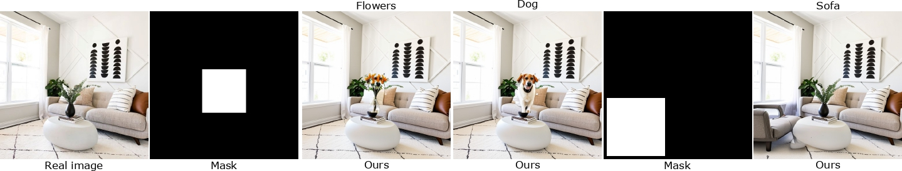

# Official Implementations "Get What You Want, Not What You Don't: Image Content Suppression for Text-to-Image Diffusion Models" (ICLR'24)</sub>

[](https://arxiv.org/abs/2402.05375) [](https://arxiv.org/pdf/2402.05375.pdf) [](https://www.youtube.com/watch?v=4DL13cjL0Qc&t)

[//]: # (**Get What You Want, Not What You Don't: Image Content Suppression for Text-to-Image Diffusion Models**<br>)
<hr />

**Abstract**: The success of recent text-to-image diffusion models is largely due to their capacity to be guided by a complex text prompt, which enables users to precisely describe the desired content. However, these models struggle to effectively suppress the generation of undesired content, which is explicitly requested to be omitted from the generated image in the prompt. In this paper, we analyze how to manipulate the text embeddings and remove unwanted content from them. We introduce two approaches, which we refer to as **soft-weighted regularization** and **inference-time text embedding optimization**. The first regularizes the text embedding matrix and effectively suppresses the undesired content. The second method aims to further suppress the unwanted content generation of the prompt, and encourages the generation of desired content. We evaluate our method quantitatively and qualitatively on extensive experiments, validating its effectiveness. Furthermore, our method is generalizability to both the pixel-space diffusion models (i.e. DeepFloyd-IF) and the latent-space diffusion models (i.e. Stable Diffusion).

<hr />

## 👀 Observation


Existing text-to-image models can encounter challenges in effectively suppressing the generation of the negative target. For example, when requesting an image using the prompt "a face without glasses",  the diffusion models (i.e., SD) synthesize the subject without "glasses", as shown in Figure (the first column).  However, when using the prompt "a man without glasses", both SD and DeepFloyd-IF models still generate the subject with "glasses" (It also happens in both *Ideogram* and *Mijourney* models, see Appendix F),  as shown in Figure (the second and fifth columns).   Figure (the last column) quantitatively show that SD has 0.819 *DetScore* for "glasses" using 1000 randomly generated images, indicating a very common failure cases in diffusion models.  Also, when giving the prompt "a man", often the glasses are included, see Figure (the third and sixth columns).  

## 🛠️ Method Overview


<span id="method-overview"></span>


Overview of the proposed method. (a) We devise  a negative target embedding matrix $\boldsymbol\chi$: $\boldsymbol\chi = [\boldsymbol{c}^{NE},\boldsymbol{c}^{EOT}\_0, \cdots, \boldsymbol{c}^{EOT}\_{N-{|\boldsymbol{p}|-2}}]$.  We perform SVD for the embedding matrix $\boldsymbol\chi=\textbf{\emph{U}}{\boldsymbol\Sigma}{\textbf{\emph{V}}}^T$. We introduce a soft-weight regularization (SWR) for each largest eigenvalue. Then  we recover the embedding matrix $\hat{\boldsymbol\chi}=\textbf{\emph{U}}{\hat{\boldsymbol\Sigma}}{\textbf{\emph{V}}}^T$. (b) We propose inference-time text embedding optimization (ITO).  We align the attention maps of both $\boldsymbol{c}^{PE}$ and  $\boldsymbol{\hat{c}}^{PE}$, and widen  the ones of  both $\boldsymbol{c}^{NE}$ and $\boldsymbol{\hat{c}}^{NE}$.

## 💻 Requirements
The codebase is tested on 
* Python 3.8
* PyTorch 1.12.1
* Quadro RTX 3090 GPUs (24 GB VRAM) with CUDA version 11.7

environment or python libraries:

```
pip install -r requirements.txt
```


## 🎊 Suppression for real image
```shell
python suppress_eot_w_nulltext.py  --type Real-Image \
                                   --prompt "A man with a beard wearing glasses and a hat in blue shirt" \
                                   --image_path "./example_images/A man with a beard wearing glasses and a hat in blue shirt.jpg" \
                                   --token_indices "[[4,5],[7],[9,10],]" \
                                   --alpha "[1.,]" --cross_retain_steps "[.2,]"
```


You can use **NPI** ([Negative-prompt Inversion](https://arxiv.org/abs/2305.16807)) for faster inversion of the real image, but it may lead to a certain degree of degradation in editing quality:
```shell
python suppress_eot_w_nulltext.py  --type Real-Image --inversion NPI\
                                   --prompt "A man with a beard wearing glasses and a hat in blue shirt" \
                                   --image_path "./example_images/A man with a beard wearing glasses and a hat in blue shirt.jpg" \
                                   --token_indices "[[4,5],[7],[9,10],]" \
                                   --alpha "[1.,]" --cross_retain_steps "[.2,]"
```

## 🎊 Suppression for generated image
```shell
python suppress_eot_w_nulltext.py --type Generated-Image \
                                  --prompt "A dog in Van Gogh Style" --seed 2023 \
                                  --token_indices "[[4,5,6],]" \
                                  --alpha "[1.,]" --cross_retain_steps "[.2,]" --iter_each_step 0
```


Our method can suppress copyrighted materials and memorized images from pretrained text-to-image diffusion models, such as [ESD](https://arxiv.org/abs/2303.07345), [Concept-ablation](https://arxiv.org/abs/2303.13516) and [Forget-Me-Not](https://arxiv.org/abs/2303.17591), and it is training-free.

## 🪄 Additional application

### 1️⃣ Generating subjects for generated image ([Attend-and-Excite](https://arxiv.org/abs/2301.13826) similar results)

```
python suppress_eot_w_nulltext.py  --type Generated-Image \
                                   --prompt "A painting of an elephant with glasses" --seed 16 \
                                   --token_indices "[[7],]" \
                                   --alpha "[-0.001,]" --cross_retain_steps "[.2,]" --iter_each_step 0
```


### 2️⃣ Adding subjects for real image ([GLIGEN](https://arxiv.org/abs/2301.07093) similar results)

```
python suppress_eot_w_nulltext.py  --type Real-Image \
                                   --prompt "A car near trees with raining" \
                                   --image_path "./example_images/A car near trees.jpg" \
                                   --token_indices "[[6],]" \
                                   --alpha "[-0.001,]" --cross_retain_steps "[.2,]" --iter_each_step 0
```


### 3️⃣ Replacing subject in the real image with another

```
python suppress_eot_w_nulltext.py  --type Real-Image \
                                   --prompt "a robot is jumping out of a jeep" \
                                   --image_path "./example_images/a man is jumping out of a jeep.jpg" \
                                   --token_indices "[[2],]" \
                                   --alpha "[-0.001,]" --cross_retain_steps "[.5,]" --iter_each_step 0
```


### 4️⃣ (Top) Cracks removal results. (Middle) Rain removal for synthetic rainy image. (Bottom) Rain removal for real-world rainy image

```
python suppress_eot_w_nulltext.py  --type Real-Image \
                                   --prompt "A photo with cracks" \
                                   --image_path "./example_images/A photo with cracks.jpg" \
                                   --token_indices "[[4],]" \
                                   --alpha "[1,]" --cross_retain_steps "[.5,]"
```


## ⚗️Work in progress



## 📐 Quantitative comparison
Following [Inst-Inpaint](https://arxiv.org/abs/2304.03246), we use FID and CLIP Accuracy to evaluate the accuracy of the removal operation on the GQA-Inpaint dataset. We achieve superior suppression results and higher CLIP
Accuracy scores on the GQA-Inpaint dataset.

There are 18883 pairs of test data in the GQA-Inpaint dataset, including source image, target image, and prompt. Inst-Inpaint attempts to remove objects from the source image based on the provided prompt as an instruction (e.g., "Remove the airplane at the center"). We suppress the noun immediately following "remove" in the instruction (e.g., "airplane") and use the remaining part, deleting the word "remove" at the beginning of the instruction to form our input prompt (e.g., "The airplane at the center").


Outputs for GQA-Inpaint in [Inst-Inpaint](https://drive.google.com/file/d/1xBKNEcxjF5Hk4a_PrUmQqTe25Oz1qQMq/view?usp=sharing) and [Ours](https://drive.google.com/file/d/1mcd4mzTlbo4lHC6eEn36s1ZsmtWrbcyR/view?usp=sharing).


## 🤝🏻 Citation
<span id="citation"></span>

```bibtex
@inproceedings{li2023get,
  title={Get What You Want, Not What You Don't: Image Content Suppression for Text-to-Image Diffusion Models},
  author={Li, Senmao and van de Weijer, Joost and Khan, Fahad and Hou, Qibin and Wang, Yaxing and others},
  booktitle={The Twelfth International Conference on Learning Representations},
  year={2023}
}
```


### Contact
Should you have any questions, please contact senmaonk@gmail.com

### License
The code in this repository is licensed under the MIT License for academic and other non-commercial uses.

[//]: # (For commercial use of the code and models, separate commercial licensing is available. Please contact authors.)


**Acknowledgment:** This code is based on the [P2P, Null-text](https://github.com/google/prompt-to-prompt) repository. 